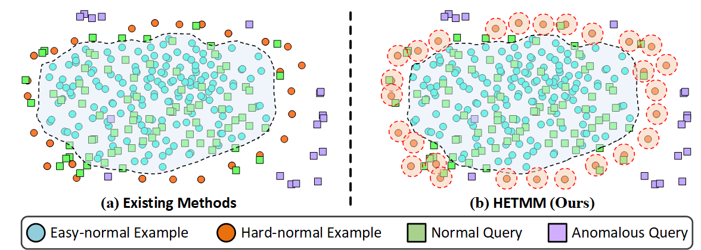
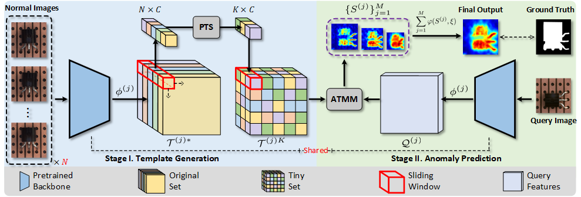

# Hard-normal Example-aware Template Mutual Matching for Industrial Anomaly Detection

[Zixuan Chen](https://narcissusex.github.io), [Xiaohua Xie](https://cse.sysu.edu.cn/content/2478), [Lingxiao Yang](https://zjjconan.github.io/), [Jian-Huang Lai](https://cse.sysu.edu.cn/content/2498),

*International Journal of Computer Vision (**IJCV**)*, 2024.

**TL;DR:** HETMM is a simple yet effective framework for industrial anomaly detection based on template matching, which can accurately detect and locate unknown anomalies in a training-free manner.

---
[](https://arxiv.org/abs/2303.16191)
[](https://drive.google.com/drive/folders/1c4XvmugX-ryP168bDMFcScdiYWgYktlu?usp=drive_link)
[](https://pan.baidu.com/s/1HH_3FQo1K72HbUvZpfylxw?pwd=eeg9)

	
[](https://paperswithcode.com/sota/anomaly-detection-on-mvtec-ad?p=hard-nominal-example-aware-template-mutual)
[](https://paperswithcode.com/sota/anomaly-detection-on-visa?p=hard-nominal-example-aware-template-mutual)
[](https://paperswithcode.com/sota/anomaly-detection-on-surface-defect-saliency?p=hard-nominal-example-aware-template-mutual)

## Motivation
<div align=center>

</div>

<b>Visualization of training data (ball) and queries (cube) via t-SNE</b>. Visually, existing methods' decision boundaries are dominated by the overwhelming number of easy-normal examples (<b><font style="color:#3288A0">blue balls</font></b>). Hence, the normal queries (<b><font style="color:#6DA945">green cubes</font></b>) near the hard-normal examples (<b><font style="color:#EB720E">orange balls</font></b>) are prone to be erroneously identified as anomalies (<b><font style="color:#B477FD">purple cubes</font></b>), resulting in a high false-positive or missed-detection rate. To address this issue, we propose <b>HETMM</b> to construct a robust prototype-based decision boundary, which can accurately distinguish hard-normal examples from anomalies.

## Framework
<div align=center>

</div>

<b>The overall framework of our methods.</b> In <b>stage I</b>, the original template set $\mathcal{T}^{(j)}$ is the aggregation of the features extracted by feeding $N$ collected normal images $\mathcal{Z}$ into the pre-trained backbone $\Phi$ with $M$ layers, where each color on $\mathcal{T}^{(j)}$ denotes that the feature is extracted from different normal images. To streamline $\mathcal{T}^{(j)}$ into a tiny set $\mathcal{T}^{(j)K}$ with $K$ sheets ($N\ge K$), <b>PTS</b> selects $K$ significant prototypes from $\mathcal{T}^{(j)}$ at each pixel coordinate through the sliding windows. In <b>stage II</b>, given a query image $q$, we first extract its features $\mathcal{Q}^{(j)}$ by the same pre-trained backbone $\Phi$ and then employ <b>ATMM</b> to obtain hierarchical anomaly maps $S^{(j)}$, where each $S^{(j)}$ is generated at the $j$-th layer. $S^\dagger$ is obtained as the final outputs.

## Code Usage
### 1) Get start

* Python 3.9.x
* CUDA 11.1 or *higher*
* NVIDIA RTX 3090
* Torch 1.8.0 or *higher*

**Create a python env using conda**
```bash
conda create -n hetmm python=3.9 -y
conda activate hetmm
```

**Install the required libraries**
```bash
bash setup.sh
```

### 2) Template Generation
**Original template set on MVTec AD:**
```bash
python run.py --mode temp --ttype ALL --dataset MVTec_AD
```
**Tiny set formed by PTS (60 sheets) on MVTec AD:**
```bash
python run.py --mode temp --ttype PTS --tsize 60 --dataset MVTec_AD
```
Since generating pixel-level OPTICS clusters is time-consuming, you can download the "*template*" folder from [Google Drive](https://drive.google.com/drive/folders/1c4XvmugX-ryP168bDMFcScdiYWgYktlu?usp=drive_link) / [Baidu Cloud](https://pan.baidu.com/s/1HH_3FQo1K72HbUvZpfylxw?pwd=eeg9) and copy it into our main folder as:
```
HETMM/
    ├── configs/
    ├── template/
    ├── src/
    ├── run.py
    └── ...
```

### 3) Anomaly Prediction
**Original template set on MVTec AD:**
```bash
python run.py --mode test --ttype ALL --dataset MVTec_AD
```
**Tiny set formed by PTS (60 sheets) on MVTec AD:**
```bash
python run.py --mode test --ttype PTS --tsize 60 --dataset MVTec_AD
```
Please see "*run.sh*" and "*run.py*" for more details.

## Citation

```tex
@article{Chen_2024_hetmm,
    author    = {Chen, Zixuan and Xie, Xiaohua and Yang, Lingxiao and Lai, Jianhuang},
    title     = {Hard-normal Example-aware Template Mutual Matching for Industrial Anomaly Detection},
    journal   = {International Journal of Computer Vision (IJCV)},
    publisher = {Springer}
}
```